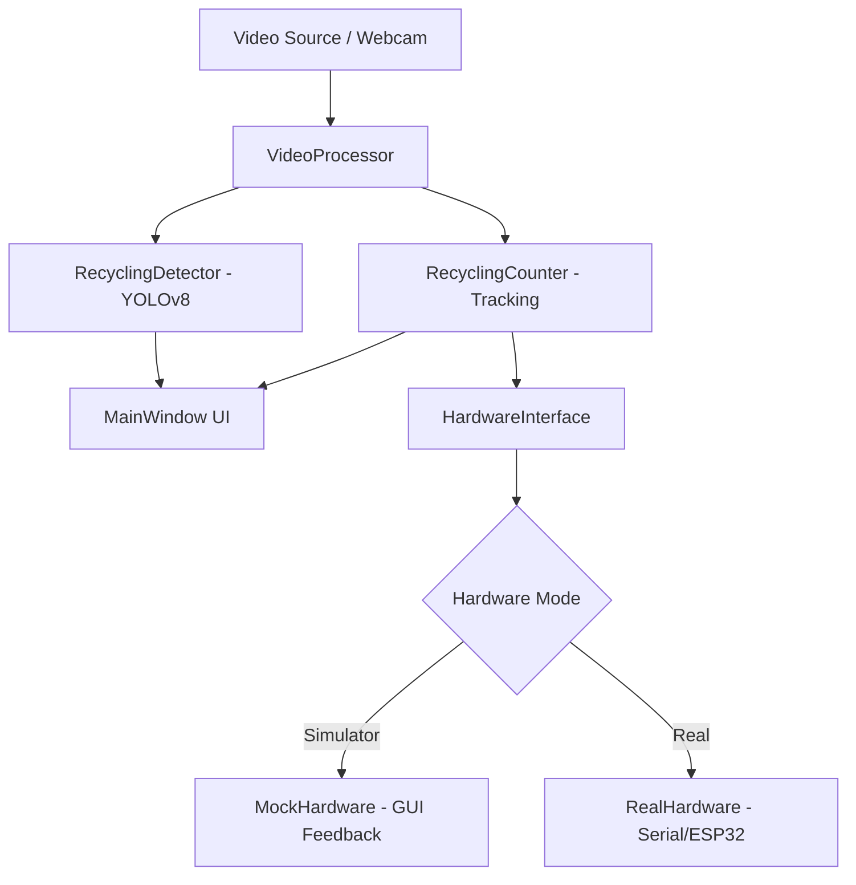

# ♻️ Smart Recycling Detection System 


> **IoT Project 🎓 Department: Electronic Engineering 🏫 University: Suranaree University of Technology (SUT)**

An intelligent real-time recycling detection system powered by YOLOv8, designed to identify and count recyclable items with high accuracy and smart tracking capabilities. This project demonstrates the practical application of state-of-the-art computer vision and object detection in environmental sustainability and smart waste management.

---

## 🏗️ Architecture

The system follows a modular architecture separating detection logic, hardware control, and user interface.



---

## 📂 Project Structure

```text
Smart-Recycling-Detection-System/
├── config/             # System configuration & logging settings
├── docs/               # Technical manuals & platform-specific guides
│   ├── mcu/            # ESP32 Firmware (esp32_servo.ino)
│   ├── installation.md # Deep-dive setup instructions
│   └── usage.md        # Detailed feature guide
├── scripts/            # Development tools & debugging scripts
├── src/                # Core implementation
│   ├── detection/      # YOLOv8 engine, Counter, & Processor logic
│   ├── hardware/       # Hardware abstraction layer (Real/Mock)
│   ├── ui/             # PyQt5 Interface components
│   └── main.py         # Application entry point
├── tests/              # Comprehensive test suite (Pytest)
├── manage.bat          # Windows automation script
├── Makefile            # Linux/macOS management script
└── docker-compose.yml  # Local services orchestration
```

---

## 🚀 Quick Start (Simulator Mode)

Test the entire system right now on your computer:

1. **Setup**: Run `manage.bat` (Windows) or `make setup` (Linux/Mac) to install dependencies.
2. **Run**: Select Option 2 (Simulator) in `manage.bat` or run `make simulator`.

---

## 🛠️ Quick Control Tools

| Feature | Windows (`manage.bat`) | Linux/macOS (`Makefile`) |
|---------|------------------------|---------------------------|
| **Install** | Option 1 (Setup) | `make setup` |
| **Run Simulator** | Option 2 | `make simulator` |
| **Run Real Hardware** | Option 3 | `make real` |
| **Docker Up** | Option 4 | `make docker-up` |
| **Docker Down** | Option 5 | `make docker-down` |

---

## 📜 Step-by-Step Guides

For detailed instructions on how to set up and run the project, please refer to:
- 💻 [Simulator Setup Guide](docs/installation.md) - For Windows users.
- 🍎 [macOS & Linux Setup Guide](docs/installation.md#linux-and-macos-installation) - For Unix-like systems.
- 🔧 [Real Hardware Setup Guide](docs/hardware_setup.md) - For assembling physical ESP32 hardware.
- 📦 [Advanced Configuration](docs/usage.md#configuration-details) - For fine-tuning detection and counting.

---

## ✨ Key Features

- **Real-time Object Detection**: High-accuracy detection using YOLOv8.
- **Smart Counting System**: Advanced tracking prevents double counting of items.
- **Hardware Integration**: Full ESP32 support for automated sorting mechanisms.
- **Professional UI**: Clean, responsive interface with live performance monitoring.
- **Dual Mode**: Seamlessly switch between physical hardware and virtual simulation.
- **Comprehensive Logging**: Detailed activity and performance logs for analysis.

---

## 🧪 Testing

The project includes a comprehensive suite of unit tests to ensure reliability:
1. **Run Tests**: `pytest tests/`
2. **Coverage**:
   - **Detector**: Verifies model loading, device selection, and prediction accuracy.
   - **Counter**: Validates object tracking, line crossing, and double-counting prevention.
   - **System**: Ensures configuration and hardware abstraction work as expected.

---

## ⚖️ License

This project is licensed under the MIT License - see the [LICENSE](LICENSE) file for details.
